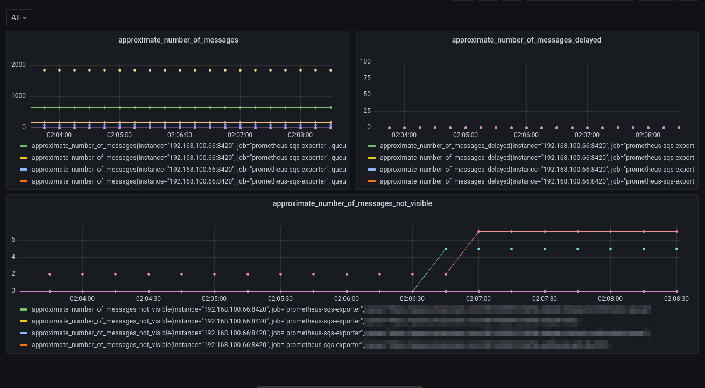

<p align="center">
  <h3 align="center">Prometheus SQS Exporter</h3>
  <p align="center">Prometheus exporter for AWS Simple Queue Service (SQS)</p>
  <p align="center">
    <a href="https://twitter.com/dmdutra_">
      
    </a>
    <a href="https://github.com/dmdutra/prometheus-sqs-exporter/actions/workflows/lint.yml">
      
    </a>
  </p>
</p>

<hr>

## Metrics

| Metric                                | Description                   |
|---------------------------------------|-------------------------------|
| ApproximateNumberOfMessages           | Returns the approximate number of messages available for retrieval from the queue  |
| ApproximateNumberOfMessagesDelayed    | Returns the approximate number of messages in the queue that are delayed and not available for reading immediately. This can happen when the queue is configured as a delay queue or when a message has been sent with a delay parameter    |
| ApproximateNumberOfMessagesNotVisible | Returns the approximate number of messages that are in flight. Messages are considered to be in flight if they have been sent to a client but have not yet been deleted or have not yet reached the end of their visibility window. |

<hr>

## Installation

```bash
pip install prometheus-sqs-exporter
```


```bash
python setup.py install
```

<hr>

## Configuration

You must have access to read SQS on Amazon

### Configure AWS credentials

https://docs.aws.amazon.com/cli/latest/userguide/cli-configure-files.html

<hr>

## Usage

```
prometheus-sqs-exporter --interval 30 --port 8420
```

## Open your browser

```
http://localhost:8420/metrics
```

<hr>

## Grafana dashboard

Import grafana dashboard from:
https://github.com/dmdutra/prometheus-sqs-exporter/blob/main/grafana/dashboard.json



<hr>
